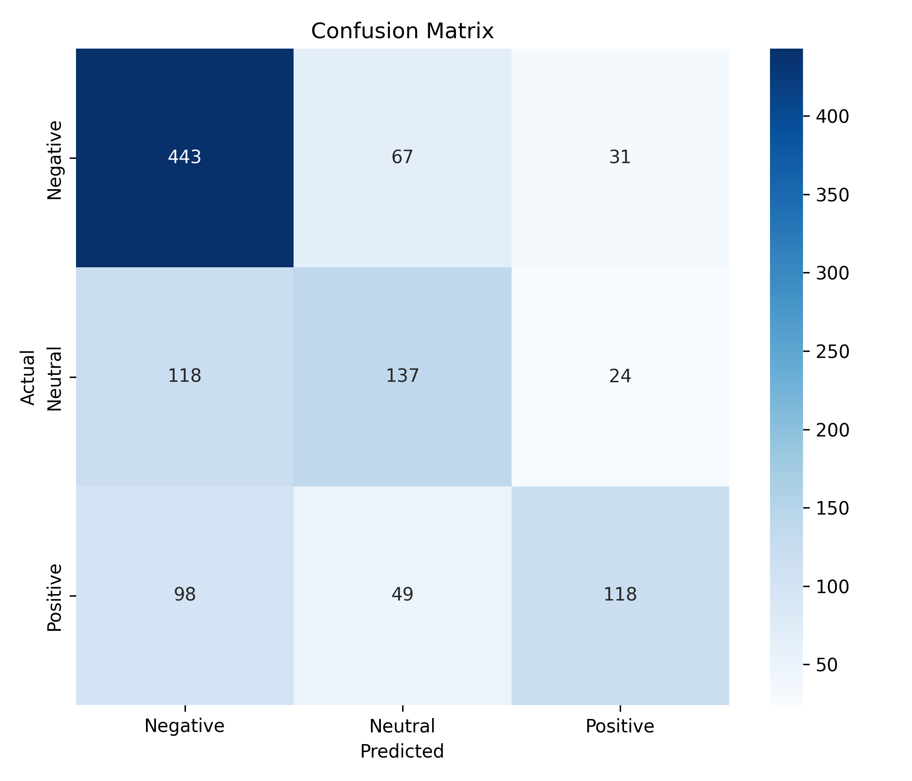
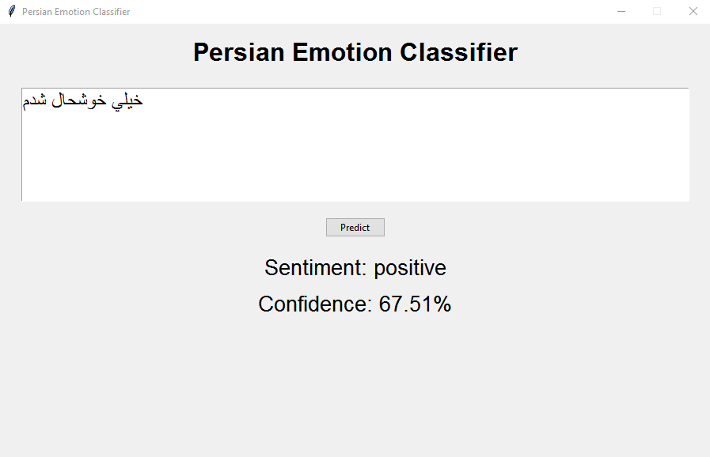

# Persian Emotion Classification using Deep Learning

A deep learning project for **Persian emotion classification** using TensorFlow, Keras, and Hazm. The system preprocesses Persian text, applies data augmentation, and trains a Bidirectional LSTM network to classify emotions into sentiment categories.

---

## Overview

This project performs emotion classification on Persian text and maps fine-grained emotions into three sentiment classes:

| Original Emotion | Sentiment |
|------------------|-----------|
| HAPPY | Positive |
| SURPRISE | Positive |
| SAD | Negative |
| ANGRY | Negative |
| HATE | Negative |
| FEAR | Negative |
| OTHER | Neutral |

The model is trained using Bidirectional LSTM layers and evaluated with accuracy, precision, recall, F1-score, and confusion matrices.

---

## Features

- Persian text normalization using Hazm
- Emotion-to-sentiment mapping
- Stratified train/validation/test splitting
- Data augmentation for minority sentiment groups
- Bidirectional LSTM architecture
- Early stopping
- Learning rate scheduling
- Best model checkpointing
- Prediction pipeline for new Persian sentences
- Saved tokenizer and label encoder for inference

---

## Dataset

### Arman Text Emotion Dataset

GitHub Repository:

https://github.com/Arman-Rayan-Sharif/arman-text-emotion

After preprocessing, emotions are mapped into:

- Positive
- Neutral
- Negative

---

## Data Cleaning

The original dataset was cleaned using `clean_data.py`.

Cleaning steps included:

- Removing null and empty samples
- Removing duplicate entries
- Normalizing formatting issues
- Exporting cleaned train file

Generated file:

- `cleaned_train.tsv`

### Notes

The cleaning process produced a cleaned training file (`cleaned_train.tsv`) and a cleaned test file. However, the cleaning procedure did not modify any samples in the original test set, so the final experiments used the original `test.tsv` file while training was performed on the cleaned training data.

---

## Preprocessing

### Text Normalization

Hazm Normalizer is used to:

- Normalize Persian characters
- Standardize spacing
- Clean textual inconsistencies

### Tokenization

Keras Tokenizer configuration:

- Vocabulary size: 11,000
- OOV token support enabled

### Sequence Processing

- Maximum sequence length: 70
- Post-padding
- Post-truncation

---

## Data Augmentation

Custom augmentation is applied only to training data.

### Random Deletion

Randomly removes a small percentage of words from longer sentences.

**Purpose:**

- Improve robustness
- Reduce memorization
- Increase training diversity

---

## Model Architecture

```text
Embedding Layer (11000, 256)
        ↓
Bidirectional LSTM (64)
        ↓
Bidirectional LSTM (32)
        ↓
Dense (32, ReLU)
        ↓
Dropout (0.5)
        ↓
Softmax Output
```

---

## Hyperparameters

| Parameter | Value |
|------------|---------|
| Embedding Dimension | 256 |
| LSTM Units | 64, 32 |
| Batch Size | 32 |
| Learning Rate | 0.001 |
| Epochs | 30 |
| Maximum Sequence Length | 70 |
| Vocabulary Size | 11,000 |

---

## Training Strategy

### Early Stopping

Monitor:

- Validation Loss (`val_loss`)

Patience:

- 10 epochs

### Learning Rate Reduction

ReduceLROnPlateau:

- Factor: 0.5
- Patience: 3

### Model Checkpointing

Automatically saves the model with the best validation loss.

---

## Final Results

### Test Performance

| Metric | Value |
|----------|----------|
| Accuracy | 64% |
| Macro F1 | 60% |

### Classification Report

| Class | Precision | Recall | F1-score |
|---------|---------|---------|---------|
| Negative | 0.67 | 0.82 | 0.74 |
| Neutral | 0.54 | 0.49 | 0.52 |
| Positive | 0.68 | 0.45 | 0.54 |

### Confusion Matrix



---

## Example Predictions

| Input | Prediction |
|---------|------------|
| خیلی خوشحال شدم | Positive |
| از این اتفاق عصبانی هستم | Negative |
| زیاد خوب نبود | Neutral |

---

## Application Demo



---

## Experiments and Optimization

Several experiments were conducted to improve model performance and reduce overfitting.

### Official Dataset Split vs Custom Stratified Split

The original ArmanEmo train/test split was evaluated first.

**Result:**
- Accuracy: approximately **45%**
- Poor generalization across sentiment classes

To improve class balance and evaluation stability, the train and test files were merged and re-split using stratified sampling based on sentiment categories.

**Result:**
- Accuracy improved to **64%**
- Macro F1 improved to **60%**

### Dataset Split Experiments

Multiple train/validation/test ratios were tested:

- 85 / 15 split
- 80 / 20 split
- Official dataset split

The final model used a **85/15 split**, providing additional training samples and improving overall performance.

### Class Weighting

Class weights were tested to compensate for class imbalance.

**Result:**

- Improved recall for minority classes
- Reduced overall accuracy
- Reduced prediction confidence
- Increased confusion between sentiment classes

The final model was trained **without class weights**.

### Data Augmentation

Several augmentation approaches were evaluated:

- Random word deletion
- Random word swapping
- Character repetition noise

Random word deletion produced the most stable results and was retained in the final version.

Augmentation was applied only to:
- Positive samples
- Neutral samples

Negative samples were left unchanged because they already dominated the dataset.

### Regularization Tuning

Multiple dropout values were tested, The final architecture uses a dropout rate of **0.5** to reduce overfitting.

### Label Smoothing

**Experiment:** `label_smoothing=0.1`

**Result:**
- Reduced prediction confidence
- No meaningful improvement in Macro F1

The technique was not included in the final model.

### SpatialDropout1D

**Experiment:** `SpatialDropout1D(0.3)` after the embedding layer.

**Result:**
- No measurable improvement
- Slight reduction in validation performance

The layer was removed from the final architecture.

---

## Key Findings

- Official dataset split achieved approximately 45% accuracy.
- Additional training data improved performance more than class weighting.
- Validation loss was a better checkpoint metric than validation accuracy.
- Simple augmentation techniques helped reduce overfitting.
- The model still struggles most with distinguishing Neutral and Positive sentiments.
- Contextual embeddings such as FastText or ParsBERT are likely to improve performance further.

---

## Technologies Used

- Python
- TensorFlow
- Keras
- NumPy
- Pandas
- Scikit-Learn
- Hazm
- Joblib

---

## Project Structure

```text
├── main.py
├── config.py
├── models.py
├── train.py
├── predict.py
├── augmentation.py
├── data_preprocessing.py
├── clean_data.py
├── visualization.py
├── inference.py
├── requirements.txt
├── data/
│   ├── test.tsv
│   ├── train.tsv
│   └── cleaned_train.tsv.tsv
├── models/
│   ├── best_model.keras
│   ├── tokenizer.pkl
│   └── label_encoder.pkl
├── results/
│   ├── gui_demo.png
│   └── confusion_matrix.png
└── README.md
```

---

## Future Improvements

Potential future work:

- FastText embeddings
- ParsBERT fine-tuning
- Transformer-based architectures

---

## Dataset Citation

This project uses the ArmanEmo dataset:

**ArmanEmo: A Persian Dataset for Text-based Emotion Detection** (2022).

Authors: Mirzaee, Hossein and Peymanfard, Javad and Moshtaghin, Hamid Habibzadeh and Zeinali, Hossein

Paper: https://arxiv.org/abs/2207.11808

If you use the dataset in academic research, please cite the original publication.

---

## Author

**Sara kaveh**

Computer Science Student focused on Machine Learning, Deep Learning, and Natural Language Processing.

GitHub: https://github.com/sara-kaveh
